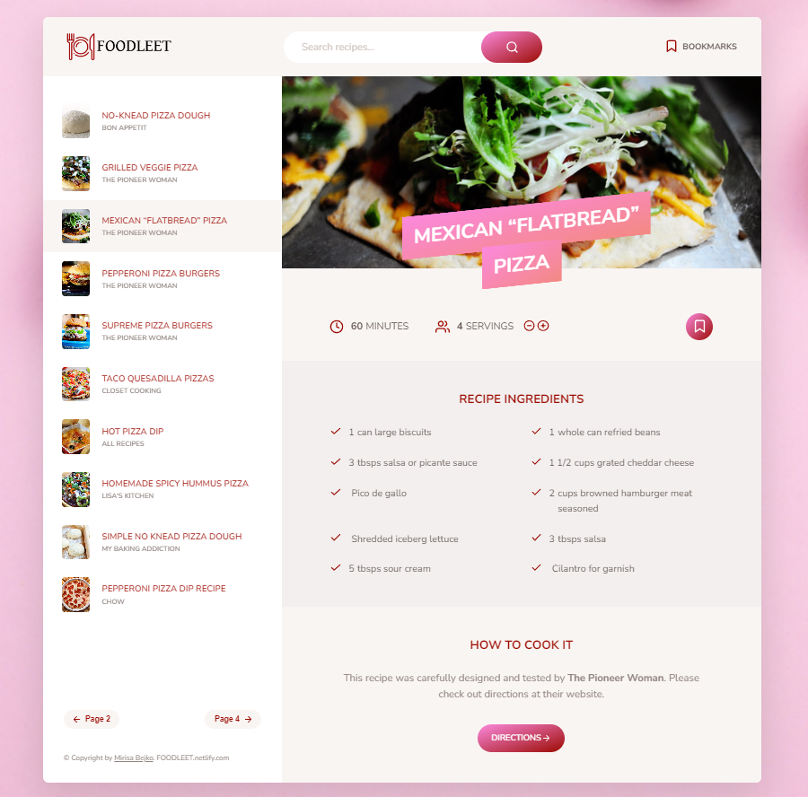

# FoodLeet

## Introduction

Welcome to FoodLeet, your go-to application for searching, bookmarking, and exploring delicious recipes! With an intuitive interface and a wide variety of recipes at your fingertips, cooking has never been more enjoyable.

## Features

- **Recipe Search:** FoodLeet leverages the Forkify API to provide you with an extensive collection of recipes. Search for your favorite recipes by name, ingredient, or cuisine.

- **Interactive Recipe Details:** Explore detailed recipe information, including a mouthwatering photo and a list of ingredients. You can also adjust the quantity of preparation to match your needs.

- **Bookmarking:** Save your favorite recipes for quick access by bookmarking them. Bookmarked recipes are stored in a dedicated section for your convenience.

## Skills Utilized

- **HTML:** The structure of the app's user interface is built using HTML.

- **SASS:** Styling and layout of the app are accomplished using SASS, a powerful CSS preprocessor.

- **JavaScript:** Interactivity and dynamic content are managed through JavaScript.

- **REST API:** The app integrates with the Forkify API to fetch a wide range of recipes.

## How to Use

1. Open the [FoodLeet App](https://foodleet.netlify.app/) in your web browser.

2. Search for recipes by entering keywords like recipe names, ingredients, or cuisine types in the search bar.

3. Browse through the search results and click on a recipe card to view detailed information.

4. Within the recipe details, you can adjust the quantity of preparation as needed.

5. To save a recipe for later, click the bookmark icon. You can find your bookmarked recipes in the dedicated bookmarks section.

## Deployment

FoodLeet is deployed using Netlify. You can access the live application by visiting the following link: [https://foodleet.netlify.app/](https://foodleet.netlify.app/)

## Contributions

Contributions to FoodLeet are welcomed! If you encounter any issues, have suggestions for improvements, or wish to contribute in any way, feel free to open an issue or submit a pull request in the app's [GitHub repository](https://github.com/your-username/your-repo-name).

## Contact

For further inquiries or more information, please feel free to contact us at [mirisabejko@outlook.com](mailto:mirisabejko@outlook.com).

Thank you for using FoodLeet and enjoy cooking up a storm with our delicious recipes!

---

_Note: Replace placeholders such as image links, GitHub repository links, and contact information with actual details._
